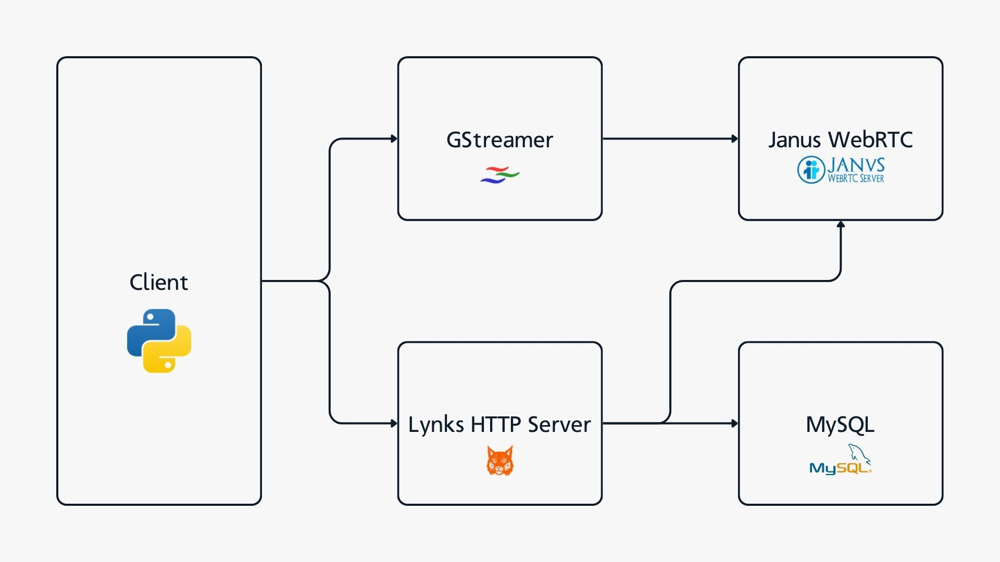

# Lynks – End-to-End Video Meeting System (C++ / WebRTC / GStreamer)
Lynks is an end-to-end video meeting system consisting of a high-performance C++ backend, Janus WebRTC Server and a WebRTC media client.

## Lynks Safe Connections – Video Meeting Backend (C++ / WebRTC)
The Lynks backend is responsible for authentication, session management, meeting orchestration, and coordination with the WebRTC media server. It exposes a REST API that clients use to log in, create meetings and discover active participants, while delegating real-time media routing to a Janus WebRTC SFU.

**Key highlights:**
* Asynchronous HTTP server in C++ (Boost.Asio/Beast) with token-based authentication and session handling
* Authenticates users via token-based sessions and validates access to all meeting-related endpoints
* Creates and manages video meeting rooms through Janus WebRTC’s VideoRoom plugin
* Exposes participant discovery endpoints, allowing clients to dynamically subscribe to active media publishers

For more information please visit: 
https://github.com/lafftale1999/lynks_backend

## Lynks Test Client – WebRTC Media Client (Python / GStreamer)
The Lynks test client implements a full WebRTC client workflow, acting as both a media publisher and subscriber. It communicates with the backend for authentication and room control, and connects directly to the Janus WebRTC server to handle real-time audio and video streaming.

**Key highlights:**
* Logs in to the backend, creates meetings, and retrieves participant lists via REST APIs
* Publishes live audio and video streams to Janus using GStreamer-based WebRTC pipelines
* Dynamically subscribes to other participants’ media streams as they join the meeting

For more information please visit: 
https://github.com/lafftale1999/lynks_testclient

## Architecture
